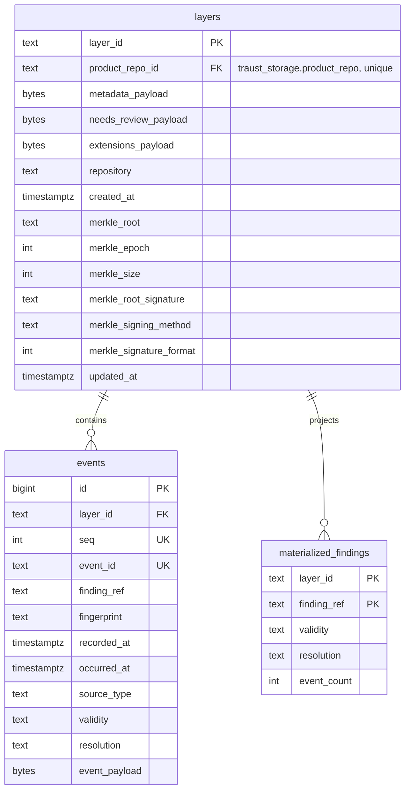

# Data model

`traust-contracts` owns the authored PostgreSQL and SQLite Ledger DDL — tables,
constraints, indexes, and append-only enforcement triggers — plus the portable
complete-layer JSON schema (`schemas/v1/layer.schema.json`).

`traust-ledger` loads contracts SQL for fresh databases and adds SQLAlchemy
query bindings, upgrade hooks, grants, and persistence. The ledger's guard
installation is idempotent (`IF NOT EXISTS` / `DROP + CREATE`) since contracts
now ships the triggers directly.

PostgreSQL uses the `traust_ledger` schema; SQLite uses a database file. The
ledger lives in the same database as traust storage: bootstrap refuses to run
until storage (`traust_contracts` `Store.init`) is initialized at its current
revision, because `layers.product_repo_id` references `traust_storage.product_repo`.

## Initialization

A layer must be explicitly initialized with a complete layer shell and the
storage product_repo it belongs to before any append:
`LedgerClient.create(layer_id, shell=..., product_repo_id=...)`,
`ledger initialize FILE --layer ID --product-repo-id ID`, or
`POST /v1/ledger/layers/{id}/initialize` with body `{"product_repo_id": ..., "layer": {...}}`.
`product_repo_id` is required on database backends (one layer per product_repo)
and ignored by the file backend, where the folder convention carries ownership.
Initialization rejects existing layers and never invents audit metadata.
Reads are anchored the same way: `GET /v1/ledger/layers` lists
`{layer_id, product_repo_id}` pairs, `?product_repo_id=` returns that
product_repo's layer (404 if none). `product_repo_id` must be a lowercase UUID
(storage-assigned) wherever it is accepted.
Historical migration is a separate administrative import; selection-manifest
records carry `product_repo_id`, and directory sources (which cannot) are
quarantined for database targets.

## Schema

`events.id` is internal storage identity. Authored order and domain identity are
separate constraints: `UNIQUE(layer_id, seq)` and `UNIQUE(layer_id, event_id)`.
Reconstruction orders by `seq`, never by timestamp.

Payloads use canonical JSON bytes (preserves U+0000, which PostgreSQL JSONB
cannot represent). Typed columns provide lifecycle indexes; payloads remain the
reconstruction authority.

## Integrity enforcement

Append-only triggers are installed by the contracts SQL during bootstrap:

| Guard | SQLite | PostgreSQL |
|-------|--------|------------|
| Reject event UPDATE/DELETE | `events_reject_update`, `events_reject_delete` | `events_reject_mutation` |
| Reject event truncation | — | `events_reject_truncate` |
| Validate append sequence | `events_validate_append` | `events_validate_append` |
| Reject layer deletion | `layers_reject_delete` | `layers_reject_delete` |
| Reject layer truncation | — | `layers_reject_truncate` |

`layers` is mutable (Merkle/signature state updates after append).
`materialized_findings` is a rebuildable projection, never integrity authority.

## Schema revision

Singleton row: `(id=1, contract_version='v1', revision=1, applied_at)`.
Fresh creation loads contracts SQL and inserts this row; mismatches fail
explicitly. No automatic downgrade or hidden migration. Runtime startup verifies
the revision without requiring schema-owner privileges.
